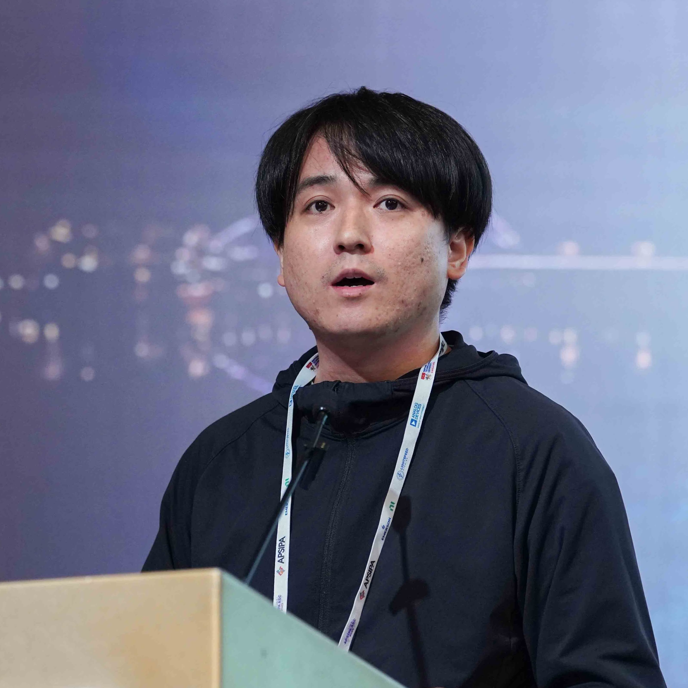

# Koki Wataoka

**Responsible AI Team, SB Intuitions / Softbank**

## About

I lead the Responsible AI Team at SB Intuitions, working on **AI Safety**, especially red-teaming and guardrails for LLMs and VLMs. Previously worked on fairness and privacy‑preserving computation. My recent work studies LLM‑as‑a‑Judge biases (verbosity / self‑preference), jailbreak attacks, and LLM fingerprinting.

## Career

| Period | Role | Organization |
|--------|------|--------------|
| 2023 – Present | Responsible AI Team | SB Intuitions |
| 2021 – 2023 | Trustworthy AI Team | LINE Corporation |
| 2019 – 2021 | MS Student | Kobe University |
| 2015 – 2019 | Undergraduate Student | Osaka City University |

## Appointments

- [Member, MIC (Japan) AI Security Subcommittee](https://www.soumu.go.jp/main_sosiki/kenkyu/cybersecurity_taskforce/02cyber01_04000001_00321.html)

## Publications

### International

- **[Foundation Models as Guardrails: LLM- and VLM-Based Approaches to Safety and Alignment](https://www.apsipa2025.org/wp/session-2/)**
  Huy Hong Nguyen, Pride Kavumba, Tomoya Kurosawa, **Koki Wataoka** — APSIPA 2025 **[Best Perspective Paper]**

- **[MergePrint: Merge‑Resistant Fingerprints for Robust Black‑box Ownership Verification of LLMs](https://aclanthology.org/2025.acl-long.342/)**
  Shojiro Yamabe, Futa Kai Waseda, Tsubasa Takahashi, **Koki Wataoka** — ACL 2025 Main

- **[Self‑Preference Bias in LLM‑as‑a‑Judge](https://arxiv.org/abs/2410.21819)**
  **Koki Wataoka**, Tsubasa Takahashi, Ryokan Ri — NeurIPS 2024 Safe Generative AI Workshop

- **[Initial Response Selection for Prompt Jailbreaking using Model Steering](https://iclr.cc/virtual/2024/23742)**
  Thien Q Tran, **Koki Wataoka**, Tsubasa Takahashi — ICLR 2024 Workshop on Secure & Trustworthy LLMs

- **[Verbosity Bias in Preference Labeling by Large Language Models](https://neurips.cc/virtual/2023/79622)**
  Keita Saito, Akifumi Wachi, **Koki Wataoka**, Youhei Akimoto — NeurIPS 2023 Workshop

### Domestic (Japan)

- **[事前学習コーパス内の特定の属性への言及の急激な変化の調査](https://www.anlp.jp/proceedings/annual_meeting/2025/)**
  大萩雅也, **綿岡晃輝**, 高山隼矢, 吉川克正 — 言語処理学会第31回年次大会 (NLP 2025)

- **[大規模言語モデルのための日本語安全性境界テスト](https://www.anlp.jp/proceedings/annual_meeting/2025/)**
  黒澤友哉, 高山隼矢, **綿岡晃輝**, 小林滉河, 浅原正幸, 西内沙恵 — 言語処理学会第31回年次大会 (NLP 2025)

- **[大規模言語モデルが有する自己選好バイアスの実態調査](https://www.iwsec.org/css/2024/program.html)**
  **綿岡晃輝**, 髙橋翼, 李凌寒 — コンピュータセキュリティシンポジウム (CSS) 2024 論文集, pp.214‑221

- **[Constitutional AIにおけるセーフティアラインメントの改善](https://www.anlp.jp/proceedings/annual_meeting/2024/)**
  **綿岡晃輝**, Thien Q. Tran, 前田若菜, 髙橋翼 — 言語処理学会第30回年次大会 (NLP 2024)

- **[モデル介入を用いる Jailbreak prompt 攻撃の初期応答の選択手法](https://www.anlp.jp/proceedings/annual_meeting/2024/)**
  Thien Q. Tran, **綿岡晃輝**, 髙橋翼 — 言語処理学会第30回年次大会 (NLP 2024)

- **[第3世代 Intel Xeon Scalable Processors による大規模 Enclave 領域を用いた Shuffling の検討](https://www.iwsec.org/css/2023/program.html)**
  長谷川聡, **綿岡晃輝**, 骻橋翼, 竹之内隆夫 — CSS 2023 論文集, pp.1412‑1419

- **[秘匿クロス集計の大規模化および P2P Remote Attestation の導入に関する一検討](https://www.iwsec.org/css/2023/program.html)**
  **綿岡晃輝**, 長谷川聡, 高橋翼, 竹之内隆夫 — CSS 2023 論文集, pp.1405‑1411

- **[言語モデルの倫理的検査のための効率的なテストケースの生成](https://www.iwsec.org/css/2022/program.html)**
  **綿岡晃輝**, 野崎雄斗, 馬越雅人, 高橋翼 — CSS 2022 論文集, pp.1322‑1328 **[奨励賞]**

- **公平性が引き起こす敵対的攻撃に対する脆弱性**
  **綿岡晃輝**, 松原崇, 上原邦昭 — 電子情報通信学会 技術研究報告 119(476), pp.101‑105, 2020

- **公平性により生じる敵対的攻撃に対する脆弱性**
  **綿岡晃輝**, 松原崇, 上原邦昭 — 人工知能学会 全国大会 (2020)

## Lectures / Presentations
- January 20, 2026: The Institute of Electronics, Information and Communication Engineers, Technical Committee on Enriched Multimedia (IEICE EMM) [[Invited Talk] Safety Practices in Foundation Model Development](https://ken.ieice.org/ken/paper/20260120fcqF/)
- March 9, 2026: The 32nd Annual Meeting of the Association for Natural Language Processing (NLP2026) [Tutorial 1: AI Safety: Bridging Academic Research and Industrial Application](https://anlp.jp/nlp2026/#tutorial)

## Patents

- **[特開2023-121470, プログラム、情報処理方法、情報処理装置](https://www.j-platpat.inpit.go.jp/p0200)**
  **綿岡晃輝** — 日本国特許庁 (Japan Patent Office)

## Contact & Links

**Email:** [wataoka.koki@gmail.com](mailto:wataoka.koki@gmail.com)

**Links:** [Google Scholar](https://scholar.google.com/citations?user=J8FuRZgAAAAJ) · [GitHub](https://github.com/wataoka) · [X](https://x.com/)